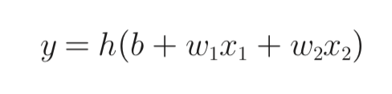
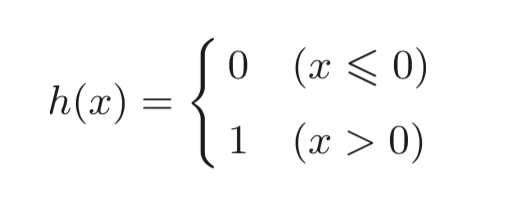
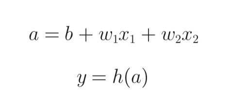
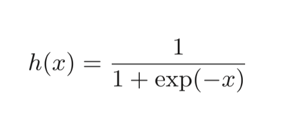
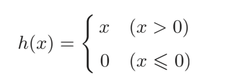

# 神经网络

感知机虽然通过叠加层可以表示复杂的函数，但是其中设定合适的，能符合预期的输入与输出的权重还是需要人工来进行，而神经网络具有的一个重要性质是可以**自动地**从数据中学习并确定到合适的权重参数。

> 假设有一个三层节点组成的神经网络，一般为了编程方便可以将节点从 0 层开始命名。至于网络层数的命名，可以根据实际  节点层数命名，也可以根据网络中实际具有权重层数命名，如前所说三层节点网络，实际具有权重层数为两层，可以称为 **2 层网络**

感知机的数学表达式为：

上面的区分情况可以通过用函数的方式来表示，用一个函数 `h` 来表示权重加成后的 0，1 判断的过程：

转换函数（也称为“激活版书”用于将输入信号的总和转换为输出信号）：将输入信号的总和转换为输出信号

## 激活函数

前面所提到的单层感知机使用的激活函数被称为：阶跃函数，这种函数的输出根据输入的不同会直接从一个输出值变为另一个输出值，就像上阶梯一样。

而神经网络则是感知机通过使用不同于阶跃函数的激活函数而构成的。

上图为 sigmoid 函数，其中 `exp(-x)` 表示 `e 的 -x 次方`

### 激活函数的对比

阶跃函数与 sigmoid 函数两者之间的结果中可以看出，阶跃函数的输出是剧烈变化的，从 0 到 1 之间没有过渡，而 sigmoid 函数则是一条平滑曲线，能够显示出 0 到 1 之间的各个数值

因此可以获知，感知机之间流动的信号为二元信号，也就是 0 与 1，而神经网络中流动的是连续的实数。

阶跃函数与 sigmoid 函数具有一些相同性质：

1. 从宏观视角来看形状相似
2. 输入值越重要时，输出值越大
3. 信号值输入再小也只能到 0，再大也只能到 1
4. 两者都是非线性函数

神经网络只能使用非线性函数，因为如果使用线性函数的话，网络层数的加深得到的叠加就没有了意义。输出值还是输入值的常数倍。

比如用一个线性函数 `h(x) = cx` 进行多层叠加 `y(x) = h(h(h(x)))` 最终结果会是 `c * c * c * x` 也就是 c 的三次方乘以 x，而 c 的三次方也就是一个常数，这个常数就是与多层叠加对应的等效无隐藏层（也就是 0 层）神经网络，所以，叠加就没有了用处。

### ReLU 函数（Rectified Linear Unit）

ReLU 函数：输入大于 0 时直接输出对应值，输入小于等于 0 时，输出 0

