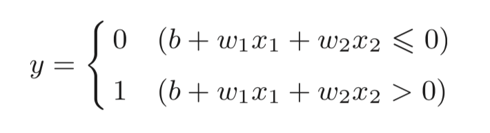

# 神经网络

感知机虽然通过叠加层可以表示复杂的函数，但是其中设定合适的，能符合预期的输入与输出的权重还是需要人工来进行，而神经网络具有的一个重要性质是可以**自动地**从数据中学习并确定到合适的权重参数。

> 假设有一个三层节点组成的神经网络，一般为了编程方便可以将节点从 0 层开始命名。至于网络层数的命名，可以根据实际  节点层数命名，也可以根据网络中实际具有权重层数命名，如前所说三层节点网络，实际具有权重层数为两层，可以称为 **2 层网络**

感知机的数学表达式为：

上面的区分情况可以通过用函数的方式来表示，用一个函数 `h` 来表示权重加成后的 0，1 判断的过程：

转换函数：

