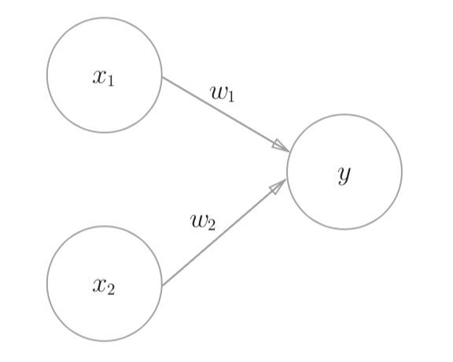
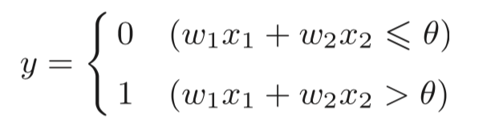
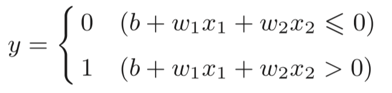
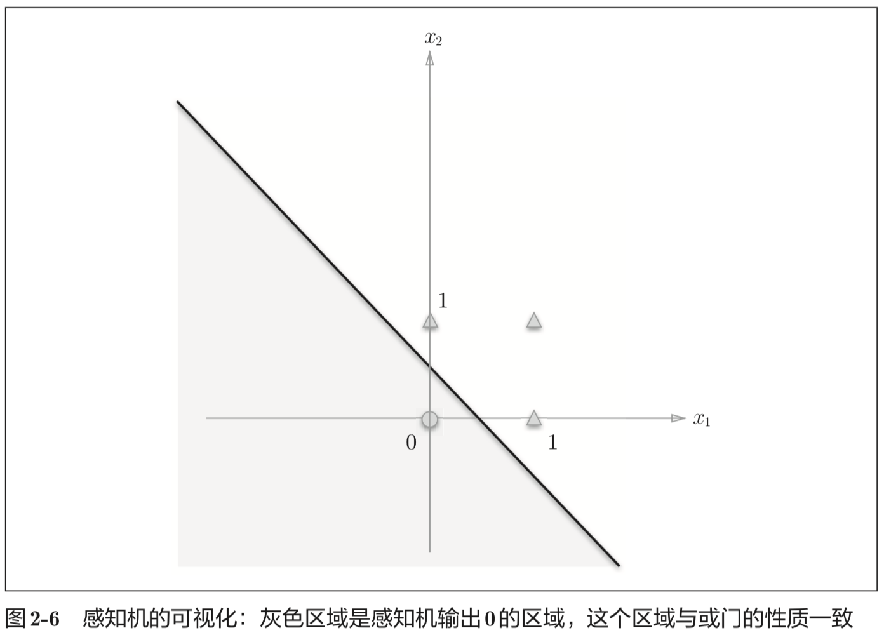
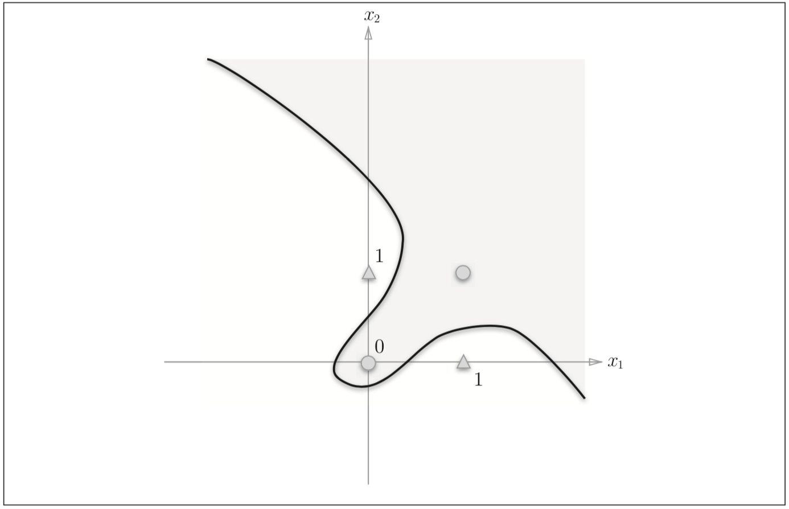
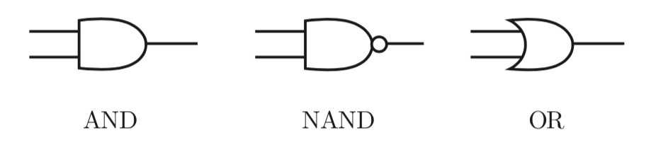
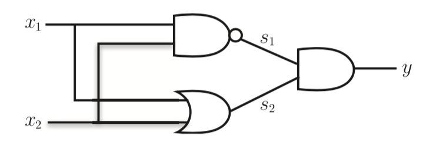
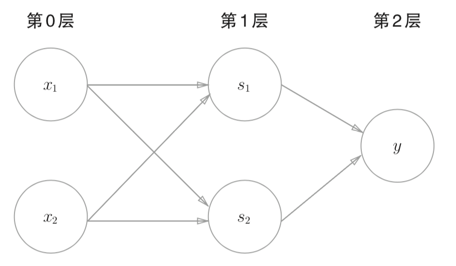

# 感知机

感知机通过接收多个输入信号（x1、x2 ...）组合后得到一个信号（y）。因为是属于计算机的概念，这里的信号只有流（1）与不留（0）两种情况。同时通过**权重（w1、w2）**进行流的调节。信号经过权重加成之后汇总得出输出信号 y，而这个 y 值只有在加成之后的**总和**超过某个界限值（阈值）时才会输出 1。这种状态也称作**激活**，这里的感知机也可以称为**神经元**，**节点**。

可以用数学公式表示有两个输入的感知机：

感知机的  权重一般是通过人工考虑得出一个值，这个值有很多可能，而机器学习中则是思考如何让机器来决定这个权重的取值，让机器自动进行。其中**学习**则是确定合适参数的过程。我们需要做的是考虑合适的模型，并提供训练数据给机器进行训练。

上面的公式可以通过将阈值换成 -b（偏置） 表示，替换成下面的式子：

从上图可知道 w1、w2 是控制输入信号的重要性的参数，b 则是用来调整神经元被激活的容易程度的参数

## 局限性

感知机能够生成一个由直线分割的空间，称为线性空间，因此使用感知机可以实现：与门、与非门、或门。

但是对于无法用一条直线将 0 与 1 进行分割的异或门则无法使用感知机进行实现，这种空间称为非线性空间。

使用曲线对非线性空间进行分割：

## 多层感知机

在前面的实现中，单层感知机无法分离非线性空间，也就是无法实现异或门的分割。而通过多层感知机叠加就能实现对非线性空间的分割。

异或门的实现：

通过感知机来表示上面的异或门实现则可以表示为如下的多层感知机：

由上图可以知道，通过不断地叠加层，感知机能够进行更灵活的表示。

而从理论上来说，通过多层感知机也就是与非门的组合就可以实现整个计算机
