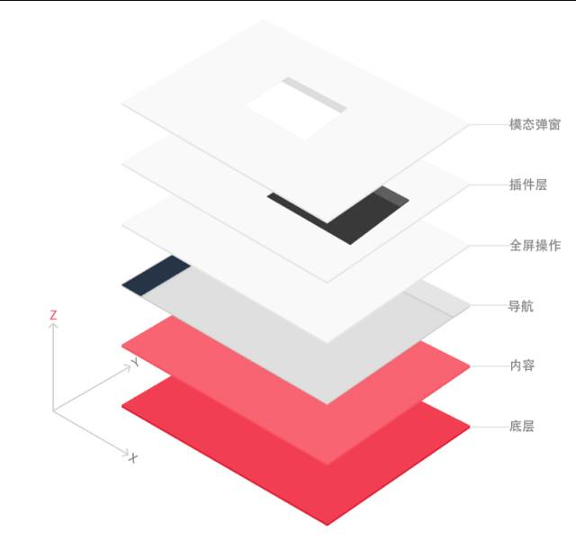

# 页面层级规范

一般情况下开发页面的时候并没有对页面各个部分的层级进行规定，这就会在后续开发的时候造成一定的混乱。

例如：

1. A 想要在某个页面加入一个弹出框
2. 用户在某个操作下生成了一个组件，这个组件在点击全屏后会调高层级，假设为：9999
3. A 的弹出框需要展示提示信息给用户，为了保证信息能够显示需要将层级至少调为：9999，同时组件的定位父级还需要在上一个组件的定位父级之后，或者组件定位父级层级较高，或者在同一定位父级，组件位置靠后，或者层级增加等。
4. 在 A 的组件之后，还需要弹出一个警告弹窗。
5. 警告弹窗也需要进行 3 的调整

以上的问题几乎每次开发或者项目中都会遇到。所以在参照 网易 UED 对页面的分层设计后。以下是其 web app 的页面层级设计：



得到下面对页面的设计

```html
<!DOCTYPE html>
<html lang="en">
  <head>
    <meta charset="UTF-8" />
    <meta name="viewport" content="width=device-width, initial-scale=1.0" />
    <meta http-equiv="X-UA-Compatible" content="ie=edge" />
    <title>Document</title>
    <style>
      [id^="layer-"] {
        position: relative;
      }
    </style>
  </head>
  <body>
    <section id="layer-basic"></section>
    <section id="layer-content"></section>
    <section id="layer-nav"></section>
    <section id="layer-fullscreen"></section>
    <section id="layer-plugin"></section>
    <section id="layer-modal"></section>
  </body>
</html>
```

各层级定义理解：

- 底层（basic）：页面的底色，边距等基础设置
- 内容（content）：页面主要的内容展示层
- 导航（nav）：导航栏挂载点
- 全屏（fullscreen）：全屏操作组件挂载点
- 插件（plugin）：第三方库等插件挂载点
- 模态弹窗（modal）：消息通知，确认交互等弹窗挂载点
