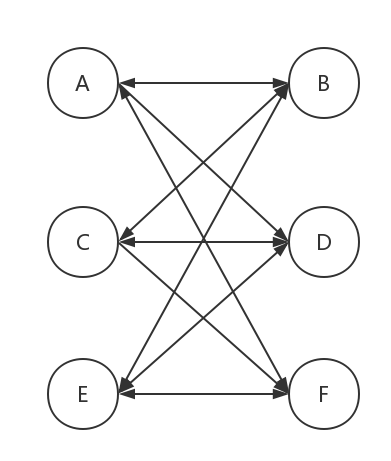
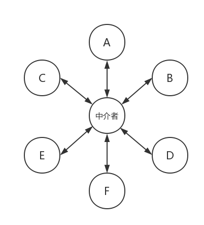

# 中介者模式

面向对象设计鼓励将行为分布到各个对象中，把对象划分成更小的粒度，有助于增强对象的可复用性，但由于细粒度对象之间的联系激增，有可能反过来导致复用性的降低

中介者模式的作用就是解除对象于对象之间的紧耦合关系，所有对象都通过中介者对象来通信，避免相互引用，当一个对象发生改变时，只需要通知中介者对象即可。

中介者模式将网状的多对多关系变成了相对简单的一对多关系。

一般网状关系

中介者模式

***

中介者模式是迎合迪米特法则的一种实现。迪米特法则也叫做最少知识原则，是指一个对象应该尽可能少地了解另外的对象

中介者模式中对象间几乎不知道彼此的存在，只能通过中介者模式来相互影响对方。

中介者模式使各个对象间解耦，以中介者与对象间的一对多的关系取代了对象间的网状多对多关系，对象只需要关注自身功能实现，对象间的交互交给中介者对象来实现和维护

由于对象间的交互全部交给中介者对象，因此对象间交互的复杂性全部变成中介者对象的复杂性，会有可能使得中介者对象过于巨大，难以维护。

适当的耦合度是可以接受的，但是当耦合度随项目的变化呈现指数级增长时，就可以考虑使用中介者模式来重构代码
